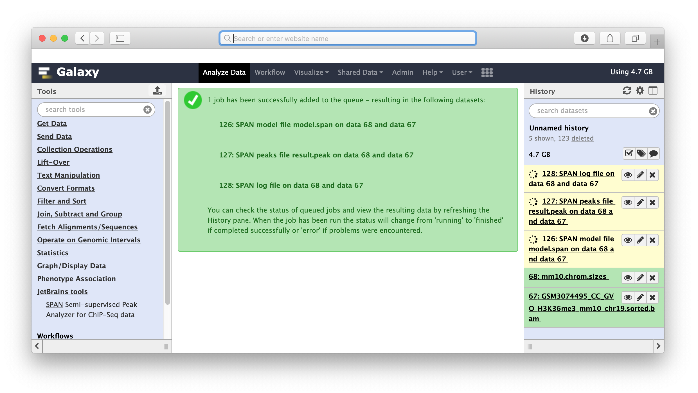
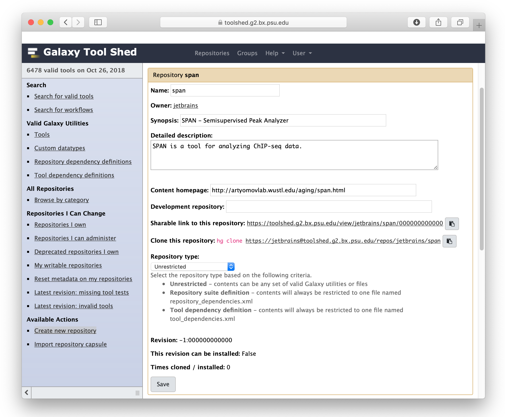
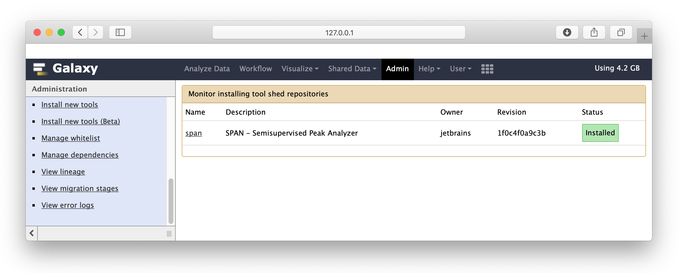
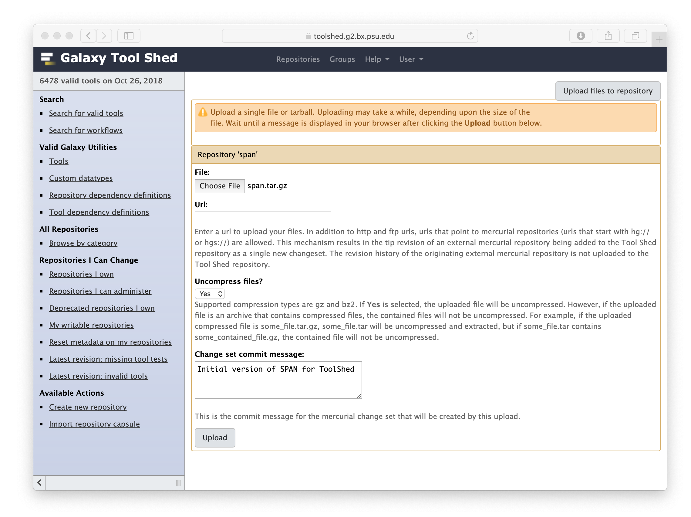

Galaxy Wrappers
===============
This repository contains wrappers for Galaxy for the following applications:
* [SPAN](https://toolshed.g2.bx.psu.edu/view/jetbrains/span) - a [tool](https://research.jetbrains.org/groups/biolabs/tools/span-peak-analyzer) for analyzing and comparing ChIP-Seq data

It **doesn't contain** source code of the applications.

Local Galaxy installation
------------------
* Install [Galaxy](https://wiki.galaxyproject.org/Admin/GetGalaxy). Checkout latest release: `git clone -b release_18.05 https://github.com/galaxyproject/galaxy.git`
* Galaxy relies on [Conda](https://anaconda.org) in dependencies management, sometimes conda packages 
can conflict with locally installed packages, e.g. installed by `pip`, `conda` or `homebrew` on MacOS. The workaround is to removed them.
Workaround is to disable/uninstall them while developing with Galaxy. 
* Launch `bash run.sh` and ensure Galaxy is serving at http://127.0.0.1:8080
* Configure admin user to be able to install 3rd party tools from ToolShed. 
Create config by copying `config/galaxy.yml.sample` to `config/galaxy.yml` and change `#admin_users: null` record.
* Install `span` from the official Galaxy ToolShed.
To verify installation went smoothly and dependencies are installed you should get 2 files available:
```
ls <GALAXY_FOLDER>/database/dependencies/package_span_jar/<VERSION>/jetbrains/span/<HASH>
env.sh              span-<VERSION>.jar
```
Local applications development
------------------------------
* Copy `span` folder to your local Galaxy installation under `tools` folder. 
For development purposes you can create symbolic link instead of copying, 
Galaxy recognizes all the filesystem changes and reloads tools on the fly. 
* Add the following line to `config/tool_conf.xml.sample`
```
    <section id="jetbrains" name="JetBrains Research tools">
        <tool file="span/span.xml" />
    </section>
```
* Restart Galaxy, SPAN should be registered as a new tool. Check within tools search window.
If everything goes successfully you should see the following output:
```
galaxy.tools.toolbox.base DEBUG 2018-10-30 16:31:45,941 [p:8990,w:0,m:0] [MainThread] Loading section: JetBrains Research tools
```


Example of files produced by `SPAN`.



Development
-----------
Galaxy updates tools definitions on-the-fly, the only limitation is that dependencies ARE NOT PROCESSED for locally installed tools.
In span case we should configure `$SPAN_JAR` environmental variable to point to span java archive file to overcome this limitation.

See for details: https://biostar.usegalaxy.org/p/10433/

Publish to tool shed
--------------------
* Login to [ToolShed](https://toolshed.g2.bx.psu.edu/repository/create_repository)
* Create repository at Toolshed via Available Actions | Create new repository

* Update tool files
* Invoke **Repository Actions** | **Reset all repository metadata**
* Voila, tool shed version is synchronized with mercurial repo
* Now you will be able to install `SPAN` from official tool shed



There are 2 options to update repository files:

* Upload files from UI action Upload files to repository
    1. Create `.tar.gz` archive with command `tar -czvf span.tar.gz *` within `span` folder.
    2. Upload it
    

* Clone mercurial repository locally
    1. Clone repository locally.
       Visit [https://www.mercurial-scm.org/wiki/CACertificates](https://www.mercurial-scm.org/wiki/CACertificates) 
       in case of error: `abort: error: [SSL: CERTIFICATE_VERIFY_FAILED] certificate verify failed (_ssl.c:726)` 
    2. Copy application folder to dedicated mercurial repository
    3. Commit and push to mercurial

Error reporting
---------------
Report any errors or comments regarding SPAN in the public issue [tracker](https://github.com/JetBrains-Research/span/issues).

Resources
---------
 * JetBrains Research BioLabs [homepage](http://research.jetbrains.org/groups/biolabs)
 * [Develop Galaxy apps](https://wiki.galaxyproject.org/Develop)
 * [Add Galaxy tool tutorial](https://wiki.galaxyproject.org/Admin/Tools/AddToolTutorial)
 * [Biostar Galaxy](https://biostar.usegalaxy.org)

