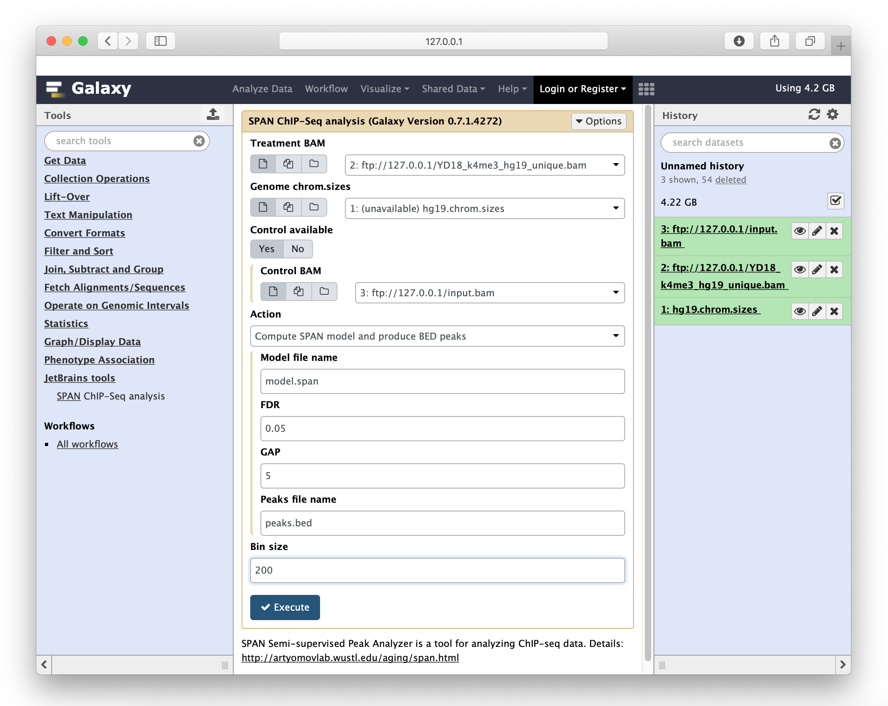

JetBrains Research Biolabs Galaxy Applications
==============================================
* [span](https://toolshed.g2.bx.psu.edu/view/jetbrains/span) - a [tool](http://artyomovlab.wustl.edu/aging/span.html) for analyzing and comparing ChIP-Seq data

Local Galaxy setup
------------------
* Install galaxy [galaxy](https://wiki.galaxyproject.org/Admin/GetGalaxy)
* Checkout latest release: `git clone -b release_18.05 https://github.com/galaxyproject/galaxy.git`
* Launch `bash run.sh` and ensure Galaxy is serving at http://127.0.0.1:8080
* Create `config/galaxy.ini` as a copy of `config/galaxy.ini.sample`
* Copy `span` folder to your local Galaxy installation under `tools` folder. 
For development purposes you can create symbolic link instead of copying, 
Galaxy recognizes all the filesystem changes and reloads tools on the fly. 
* Add the following line to `config/tool_conf.xml.sample`
```
    <section id="jetbrains" name="JetBrains Research tools">
        <tool file="span/span.xml" />
    </section>
```
* Restart Galaxy, SPAN should be registered as a new tool. Check within tools search window.
If everything goes successfully you should see the following output:
```
galaxy.tools.toolbox.base DEBUG 2018-10-30 16:31:45,941 [p:8990,w:0,m:0] [MainThread] Loading section: JetBrains Research tools
galaxy.tools.toolbox.base DEBUG 2018-10-30 16:31:45,941 [p:8990,w:0,m:0] [MainThread] Loaded tool id: span, version: 0.7.1.4272 into tool panel..
```


Publish to tool shed
--------------------
* Copy application folder to dedicated mercurial repository
* Mention snapshot version in commit message
* Commit and push to mercurial
* Invoke **Repository Actions** | **Reset all repository metadata**
* Voila, tool shed version is synchronized with mercurial repo

Useful links
------------
 * [Develop Galaxy apps](https://wiki.galaxyproject.org/Develop)
 * [Add Galaxy tool tutorial](https://wiki.galaxyproject.org/Admin/Tools/AddToolTutorial)
 * [Biostar Galaxy](https://biostar.usegalaxy.org)
 * JetBrains Research BioLabs [homepage](http://research.jetbrains.org/groups/biolabs)
